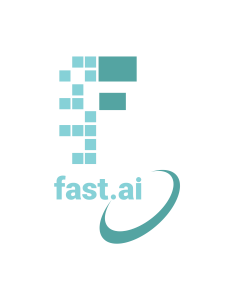

# KENNEDY KAMANDE WANGARI

## Brief Profile

Kennedy Wangari is an award winning Data Scientist based in Nairobi, Kenya. A Developer Advocate, Technical AI Community Lead, and Innovator at Deeplearning.AI: growing highly impactful tech/ developer communities in Sub-Saharan Africa, and harnessing the power of data, and innovative Artificial Intelligence Technology to make easier, and better African lives tomorrow.

Promoting access to world-class AI education in Sub-Saharan Africa and Kenya has been his top priority agenda. His tremendous advocacy efforts for better AI Education across the African continent, championing for inclusion, and better representation of black people in AI, and AI processes have earned him the honorary title: The Data Captain from Africa.

He is a key advocate, and promoter of the Sustainable Development Goal 4: promoting data science education for all. Kennedy is spearheading initiatives, actively growing, contributing, and designing training programs to empower, support, and strengthen the professional development of new African AI talent, and building a world-class artificial intelligence knowledge, research and innovation African developer ecosystem that delivers high impact transformational business use, social use cases.

Kennedy is inspiring, educating, empowering, engaging, and driving today’s professional thoughtful conversations on LinkedIn, Mainstream Media on TV, Radio, Print journalism, policy debates, webinars, and expert sessions.

He leads a thriving and highly engaging Artificial Intelligence Community of more than 300+ Kenyan students, researchers, creative, developers and AI enthusiasts to share ideas, collaborate, learn, and build innovatively with AI.

He has voluntarily dedicated his professional and personal time to help fellow tech developers from African nations be successful, and productive, availed 1500+ training and education data science scholarships and career opportunities to the Kenyan AI developer communities, growing, and improving the African’s AI developer ecosystem experience.

Kennedy has won various awards including: Deeplearning.AI Ambassador of the Year (2020), Oracle Student Award Recognition (2019), and the Contribution to Innovation, and Technology Award (JKUSA AWARDS, JKUAT 2018) 

## Me on the Internet

- Twitter: [@kennedykwangari](https://twitter.com/kennedykwangari)
- LinkedIn: [Kennedy Wangari](https://www.linkedin.com/in/kennedykwangari/)

## Communities

- [Deeplearning.AI Nairobi Community](https://www.deeplearning.ai) - A thriving and highly engaging Artificial Intelligence Community of more than 300+ Kenyan students, researchers, creative, developers and AI enthusiasts that  engages, share ideas, collaborate, learn, and build innovatively with AI.

## Books

- [Python Machine Learning Best Practices and Design Patterns](https://twitter.com/kennedykwangari/status/1378257965824753669) (PACKT, Work in Progress)

## Talks/Seminars/Workshops

I love to attend developer meetups, conferences, workshops and learn from them as much as I can. I sometimes talk on a range of topics that I love the most. All the slides of my talks/sessions can be found below.

## Given by me:

## Co-organized by me:
DevFest Kolkata, August 3, 20

## Interviews
The purpose of conducting these interviews is to mainly get insights about the real-world project experiences, perspectives on learning new things, some fun facts and thereby enriching the communities in the process. I sincerely thank the interviewees for taking the time out from their busy schedules and for agreeing to do these interviews. Here are the interviews I have done so far -

## Education
(The formal ones may be)

. Edit the `index.md` file to change this content. All pages on the blog, including this one, use [Markdown](https://guides.github.com/features/mastering-markdown/). You can include images:

 

